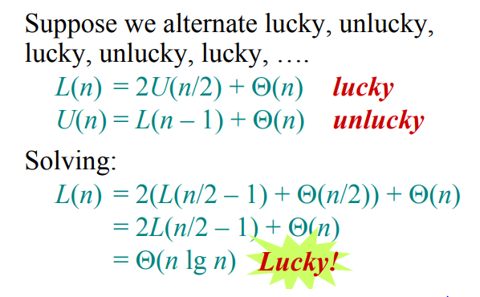
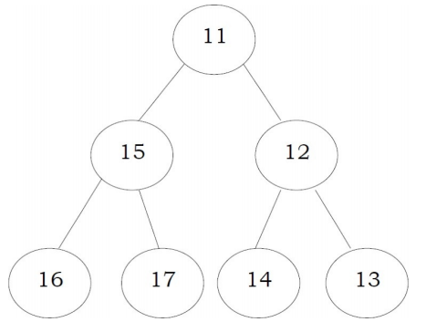
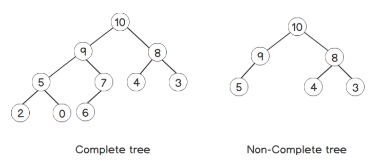

## Search Algorithms

### Linear (Sequential) Search

- Find an item in a collection of items. 

**Complexity**

- The worst case complexity is O(n)

- Comparison-based Algorithm.

  

**Code**

```cpp
// Iterative
template<typename T>
T linearSearch(T elements[], int size, T key){
    for(int i = 0; i < size; i++){
        if(elements[i] == key)
            return key;
    }
    return NULL;
}

// Recursive
template<typename T>
T linearSearch(T elements[], int size, T key){
    if(size < 0) return NULL;
    if(elements[size] == key) return key;

    return linearSearch(elements, size - 1, key);
}
```

**Recurrence Relation**

 $T(n) = T(n-1) + 1\\T(n) = 1$

### Binary Search

- Searching algorithm works on a `sorted` collection.

**Complexity**

It falls in case II of master method and the solution of the recurrence `Θ(log n)`

**Code**

```cpp
// Iterative
template <typename T>
T binarySearch(T elements[], int left, int right, T key){
    while (left <= right) {
      	int middle = (left + right) / 2;

       	if (elements[middle] == key)
           	return middle;

       	if (elements[middle] < key)
            left = middle + 1;

       	if (elements[middle] > key)
            right = middle - 1;
    }
    return NULL;
}

// Recursive
template <typename T>
T binarySearch(T elements[], int left, int right, T key){
    if (left <= right) {
      	int middle = (left + right) / 2;

       	if (elements[middle] == key)
           	return middle;

       	if (elements[middle] < key)
           	return binarySearch(elements, key, middle + 1, right);

       	if (elements[middle] > key)
            return binarySearch(elements, key, left, middle - 1);
    }
    return NULL;
}
```

**Recurrence Relation** 

$T(n) = T(n/2) + 1$


## Sorting Algorithms

### Insertion Sort

- Comparison-based Algorithm.

**Complexity**

- Worst-case Complexity: $O(n^{2})$
  - Collection is already in descending order and you want to sort ascendingly or vice versa. 
- Best-case Complexity: $O(n)$
  - If the collection is already sorted and the inner loop doesn't run at all.
- Average-case Complexity: $O(n^2)$
  - Elements in the collection neither ascends or descends.

**Code**

```cpp
template <typename T>
void insertionSort(T elements[], int size)
{
    for (int unsorted = 1; unsorted < size; unsorted++) 
    {
        T key = elements[unsorted]; // X is the item to be inserted
        
		// at first, assume first element is sorted and 
        // swap elements to its right locations
        int sorted = unsorted - 1;

        // if already sorted, then the best-case time is O(N x 1) 
        // as the inner loop consumes O(1) operations.

        while (sorted > -1 && elements[sorted] > key) {
            elements[sorted + 1] = elements[sorted];
            sorted--;
        }
        elements[sorted + 1] = key; // proper location for key.
   	}
}

template <typename T>
void insertionSort(T elements[], int size){
    if(size <= 1) return;
    insertionSort(elements, size - 1);

    T key = elements[size - 1];
    int sorted = size - 2;

    while(sorted > -1 && elements[sorted] > key){
        elements[sorted + 1] = elements[sorted];
        sorted--;
    }
    
    elements[sorted + 1] = key;
}
```

**Recurrence Relation**

$T(n) = T(n-1) + n \\T(1) = 1$

using Iterative-Substitution

$\begin{aligned}
T(n)= &T(n-1) + n \\
&=T(n-2) + (n-1) + n \\
&=T(n-3) + (n-2) + (n-1) + n \\
&=\ldots \\
&=\sum_{i=1}^{n} i \\
&=\Theta\left(n^{2}\right)
\end{aligned}$

### Merge Sort

- Stable Algorithm
  - A sorting algorithm is said to be stable if two objects with equal keys appear in the same order in sorted output as they appear in the input array to be sorted.

- Divide and Conquer (D&C) Algorithm.
  - Divide Step: Divide the current array into two halves (perfectly equal if **N** is even or one side is slightly greater by one element if **N** is odd) and then recursively sort the two halves.
  - Conquer Step: is the one that does the most work: Merge the two (sorted) halves to form a sorted array, using the merge sub-routine.

1. Merge each pair of individual element (which is by default, sorted) into sorted arrays of 2 elements,
2. Merge each pair of sorted arrays of 2 elements into sorted arrays of 4 elements,
   Repeat the process...,
3. Final step: Merge 2 sorted arrays of **N**/2 elements (for simplicity of this discussion, we assume that **N** is even) to obtain a fully sorted array of **N** elements.

**Complexity**

Time Complexity

- Best-case Complexity: $O(n log \space n)$

- Worst-case Complexity: $O(n log \space n)$

- Average-case Complexity: $O(n log \space n)$

Space Complexity

- $O(n)$

**Code**

```cpp
template <typename T>
void merge(T elements[], int left, int middle, int right){
    int leftSize = middle - left + 1;
    int rightSize = right - middle;

    T L[leftSize];
    T R[rightSize];

    for (int i = 0; i < leftSize; i++)
        L[i] = elements[left + i];

    for (int j = 0; j < rightSize; j++)
        R[j] = elements[middle + 1 + j];

    int i = 0, j = 0;
	int moveUp = left;

    while (i < leftSize && j < rightSize)
        elements[moveUp++] = (L[i] <= R[j]) ? L[i++] : R[j++];

   	while (i < leftSize) elements[moveUp++] = L[i++];

  	while (j < rightSize) elements[moveUp++] = R[j++];
}

// MergSort function.

template <typename T>
void mergeSort(T elements[], int left, int right){
    if(left < right){
        int middle = left + (right - left) / 2;
        
        mergeSort(elements, left, middle);
        mergeSort(elements, middle + 1, right);
        
        merge(elements, left, middle, right);
    }
}
```

**Recurrence Relation**

$T(n) = 2T(n/2) + n$


**Recursion Tree**


### Count Sort

Counting sort is a sorting algorithm that sorts the elements of an array by counting the number of occurrences of each unique element in the array.

**Complexity**

- **Overall Time Complexity:** $O(n + k)$

- **Overall Space Complexity:** $O(n + k)$

**Code**

```cpp
void countSort(int elements[], int size){
	int sorted[size + 1];

    int maximum = -1; // k
    for(int i = 0; i < size; i++)
        maximum = max(elements[i], maximum);

    int count[maximum + 1];

    // initialize the frequency count array to zeroes.
    // O(k)
    for(int i = 0; i <= maximum; i++)
        count[i] = 0;
	
    // count the frequency of each element of elements in count.
    // O(n)
    for(int i = 0; i < size; i++)
        count[elements[i]]++;

    // find cumulative freuqency.
    // O(k)
    for(int i = 1; i <= maximum; i++)
      	count[i] += count[i-1];
	
    // O(n)
  	for(int i = 0; i < size; i++) {
      sorted[count[elements[i]] - 1] = elements[i];
      count[elements[i]]--; //decrease count for same numbers
    }
    
	// O(n)
    for(int i = 0; i < size; i++)
        elements[i] = sorted[i];
}
```

### Quick Sort

- Divide and Conquer (D&C) Algorithm.
- Sorts elements in-place

**Algorithm**

1. Partition the array into two subarrays around pivot.
2. lower subarray elements <= pivot <= upper subarray elements.
3. Recursively sort the 2 subarrays.
4. Combine.


**Analysis** 

1. Worst-case

   

   - Elements already sorted or reversely sorted.
   - One side of partition has no elements.
   - $T(n) = T(0) + T(n-1) + \theta(n)$
   - $T(n) = T(n-1) + \theta(n)$
   - $T(n) = O(n^{2})$

2. Best-case

   

   

   - Called lucky-unlucky case
   - Partition splits the elements evenly:
     - $T(n) = 2T(n/2) +\theta(n)$
     - $T(n) = \theta(n\space log\space n)$

**Code**

```cpp
template <typename T>
int partitionArray(T Array[], int low,int high) {
	int pi = low;
    T pivot = Array[high];

	//pivot value is inserted at correct position
	//  where elements < pivot are on the left
	//  and elements > pivot are on the right;

	int pivotIndex = high; // sizearray - 1;
    
    // from 0 to n
	for (int i = low; i < pivotIndex; i++) {
		if (Array[i] <= pivot) {
			swap(Array[i], Array[pi++]);
		}
	}
	swap(Array[pi], Array[high]);

    return pi; // return the proper location of pivot.
}

template <typename T>
void quickSort(T Array[], int low, int high) {
	if (low < high) {
		int newPivotIndex = partitionArray(Array, low, high);
        // partitioning subroutine takes linear time. O(N)

		quickSort(Array, low, newPivotIndex - 1); 
        // recursively sort left-side of the array

		// a[m] = pivot is already sorted after partition
		quickSort(Array, newPivotIndex + 1, high);
        // then sort right-side of the array
	}
}
// initial call: 
quickSort<char>(Array, 0, sizearray-1);
```

**Recurrence Relation**

- Worst-case: $T(n) = T(n-1) + \theta(n)$
- Best-case: $T(n) = 2T(n/2) +\theta(n)$

**Recursion Tree**

- Worst-case: $O(n^{2})$

  

- Best-case: $\theta(n\space log\space n)$

  

#### Randomized Quick Sort

**Algorithm**

- Partition around a random element(we choose random number k between low and high)
- Note: Running time is independent of input ordering

**Analysis**

- Not Required.

**Implementation**

```cpp
template <typename T>
int partitionArray(T Array[], int low,int high) {
	int pi = low;
    T pivot = Array[high];

	//pivot value is inserted at correct position
	//  where elements < pivot are on the left
	//  and elements > pivot are on the right;

	int pivotIndex = high; // sizearray - 1;
    // from 0 to n
	for (int i = low; i < pivotIndex; i++) {
		if (Array[i] <= pivot) {
			swap(Array[i], Array[pi++]);
		}
	}
	swap(Array[pi], Array[high]);

    return pi; // return the proper location of pivot.
}

template <typename T>
int partition_r(T Array[], int low, int high)
{
    // Generate a random number in between
    // low .. high
    srand(time(NULL));
    int random = low + rand() % (high - low);
 
    // Swap A[random] with A[high]
    swap(Array[random], Array[high]);
 
    return partition(Array, low, high);
}
template <typename T>
void quickSort(T Array[], int low, int high) {
	if (low < high) {
		int newPivotIndex = partition_r(Array, low, high);
        // partitioning subroutine takes linear time. O(N)

		quickSort(Array, low, newPivotIndex - 1); 
        // recursively sort left-side of the array

		// a[m] = pivot is already sorted after partition
		quickSort(Array, newPivotIndex + 1, high);
        // then sort right-side of the array
	}
}
// initial call: 
quickSort<char>(Array, 0, sizearray-1);
```

### Heap Sort

[RECOMMENDED](https://youtu.be/k72DtCnY4MU)

- Sort a collection of elements using heap representations.

#### Heap Itself

- Heap is a complete binary tree. A value of a node must be `>= (or <=)` than the values of its children.

  - `>=` indicates a `max-heap`, The `greatest` value in the structure is in the root node.

    

  - `<=` indicates a `min-heap`, The `smallest` value in the structure is in the root node. 

    

- [Complete Binary Tree](https://www.programiz.com/dsa/complete-binary-tree) all levels are full, except possibly the last one, which is filled from left to right
  
  - <div dir="rtl">
    <strong>
        بنضيف العناصر من اخر Level بإعتبار إن فيه مكان فاضي من الشمال لليمين، ولو مفيش نعمل Level جديد و نضيف من الشمال خالص
    </strong>
    </div>
  
    
  
  - In one sentence, Top to bottom, Left to right.
  
- These heap properties must be met.

- We don't need to be worry about the tree and its implementation (nodes, pointers, etc.) because a heap can be represented as an array level by level.

​	**Building Heap**

- An array representation for Heap would be:

  - If the parent is the $i^{th}$ node, its children will always be `2*i + 1` and `2*i + 2`
  - The parent node for the $i^{th}$ node is `(i - 1)/2`

- The operations that preserve the heap properties are:

  1. BUILD-HEAP: takes an array and represent it to a max-heap.

  2. HEAPIFY - Maintains the heap properties. Could be MAX-HEAPIFY or MIN-HEAPIFY  

**Algorithm**

Sorting a collection of elements as follows:

- **Build**: Build the heap itself. 

- **Extraction**: Delete the maximum element repeatedly which is at the root.
  - **MAX-HEAPIFY**.

The order in which the element are deleted gives the sorted sequence

**Analysis**

- Build-Heap takes exactly linear time: Θ(n) 

**Complexity** 

- In all cases it has a complexity of `n Log (n)`

**Code**

```cpp
template <typename T>
void heapify(T input[], int currentNode, int inputSize){
    int leftChild  = (2 * currentNode) + 1;
    int rightChild = (2 * currentNode) + 2;
    
    int largest = currentNode;

    if(leftChild < inputSize && input[leftChild] > input[largest])
        largest = leftChild;

    if(rightChild < inputSize && input[rightChild] > input[largest])
        largest = rightChild;

    if(largest != currentNode){
        swap(input[currentNode], input[largest]);
        heapify(input, largest, inputSize);
    }
}

template <typename T>
void buildHeap(T input[], int inputSize){
    // i: currentNode
    
	// the last level already has the properties of a heap. 
    // Followed by that, we go level by level toward the root, making each
	// subtree follow the heap properties one by one.
    
    for(int i = inputSize / 2 - 1; i >= 0; i--){
        heapify(input, i, inputSize);
    }
}

template <typename T>
void heapSort(T input[], int inputSize){
    buildHeap(input, inputSize);
    
    // i: currentNode
    for(int i = inputSize - 1; i > 0; i--){
        swap(input[0], input[i]);
        heapify(input, 0, i);
    }
}
```

**Recurrence Relation**

$T(n) = T(n − 1) + log (n)\\ T(1) = 0$


