## Asymptotic Notations


### Upper Bound - Big O
- Notation: **F(n) = O(G(n))** 

- A function F(n) is upper-bounded by G(n) such that 


- Note: write the G(n) that is closest to F(n)
### Lower Bound - Big Omega
- Notation: **F(n)= Ω(G(n))**

- A function F(n) is lower-bounded by G(n) such that
= c * G(n)">

### Average Bound - Theta
- Notation: **F(n) = Θ(G(n))**

- A function F(n) is bounded by G(n) such that it can be sandwiched between


Note: c, c1, c2 are all positive constants.

## Asymptotic Notations Properties

#### Reflexivity 

```
if f(n) is given then:
    f(n) = O(f(n)) 
    f(n) = Ω(f(n)) 
    f(n) = Θ(f(n))
```

#### Symmetry

  f(n) = Θ(g(n)) if and only if g(n) = Θ(f(n))

  example:
      f(n) = n^2 
      g(n) = n^2
      then f(n) = Θ(n2) and g(n) = Θ(n2)

#### Transitivity

  f(n) = O(g(n)) and g(n) = O(h(n)) ⇒ f(n) = O(h(n))
  example:
      f(n) = n 
      g(n) = n^2 
      h(n) = n^3
      
  	n is O(n^2) 
      n^2 is O(n^3)
  then 
      n is O(n^3)
#### Transpose Symmetry

  f(n) = O(g(n)) if and only if g(n) = Ω(f(n))

  - If f(n) = n and g(n) = n2 then n is O(n2) and n2 is Ω(n)
## Logarithmic Rules


## Some Arithmetic Rules

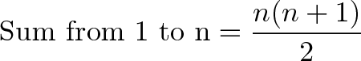

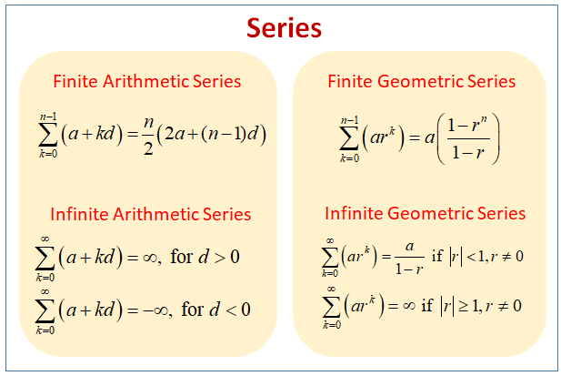

## Recurrences

### Substitution Method

#### [Explanation](https://youtu.be/jz1GQ4wJcYA)

#### Steps

- Guess a solution.
  - T(n) = O(g(n))

- Use induction to prove that the solution works.
  - Simple Case.
  - Induction hypothesis. Relation is valid at k where T(k) <= c * g(k)
  - induction goal (apply the definition of the asymptotic notation)

#### Examples

### Iterative Method

- [Plug-and-chug by John Bowers](https://youtu.be/Ob8SM0fz6p0)

### Recursion Tree

- [Recurrence Tree by John Bowers](https://youtu.be/sLNPd_nPGIc)

### Master Method

- The master method applies to recurrences of the form


​	where a >=1, b > 1 and f(n) > 0

#### Case 1


 f(n)">


#### Case 2


#### Case 3

Regularity condition must be met

Condition: a * f(n/b) <= c * f(n) for some c < 1


#### Steps

1. Compute a, b, f(n), and c, where  logb(a) {log a base b}
2. Get n^(logb(a))
3. Compare (2) with f(n)
4. Determine the appropriate case

#### Examples

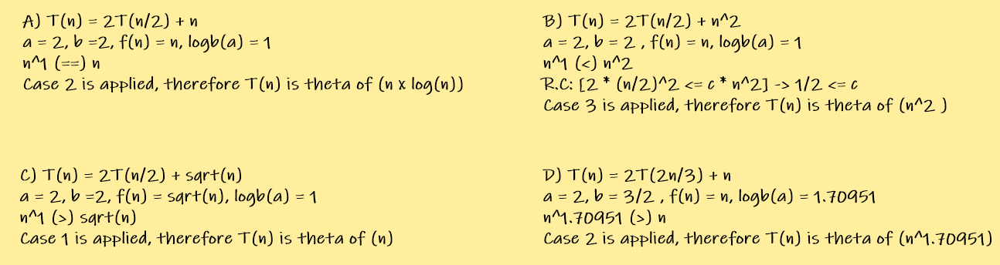

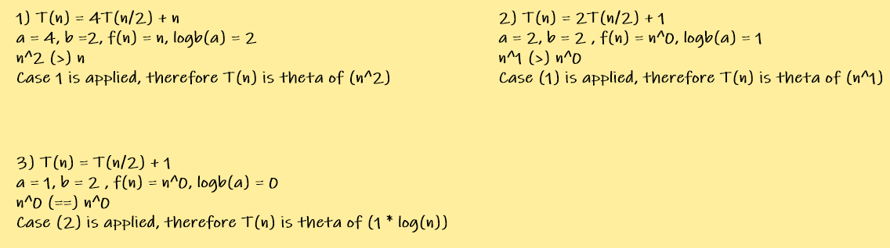

## Common Recurrence Relations

### Binary Search

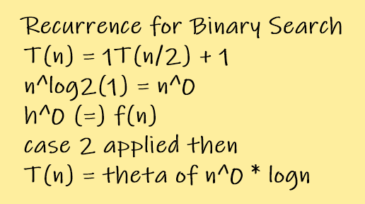

### Merge Sort

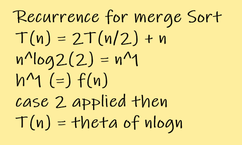

### Powering a Number

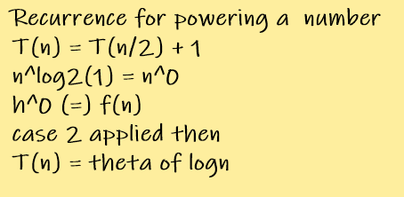

	##### Formula


### Fibonacci Numbers

#### Naïve Solution


F(n) = n for n = 0 or n = 1

Exponential Time: Golden ratio power n


#### Recursive Squaring

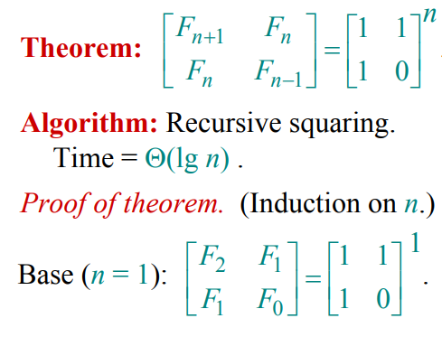

Assume n = 2.

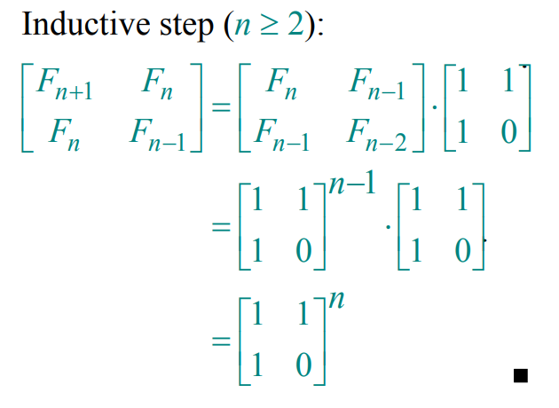

### Matrix Multiplication

#### Naïve Solution

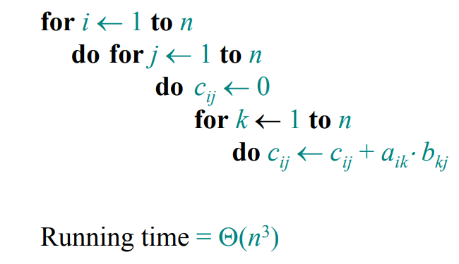

#### DC Algorithm

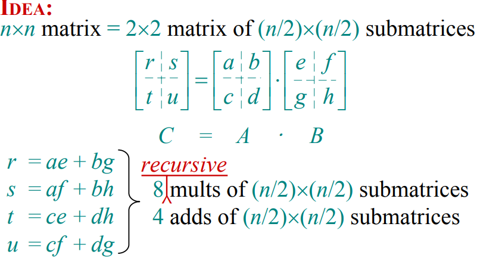

T(n) = 8T(n/2) + Θ(n^2)

T(n) = Θ(n^3)

#### Strassen Algorithm

This algorithm reduces the number of multiplication from 8 to 7 (:d)

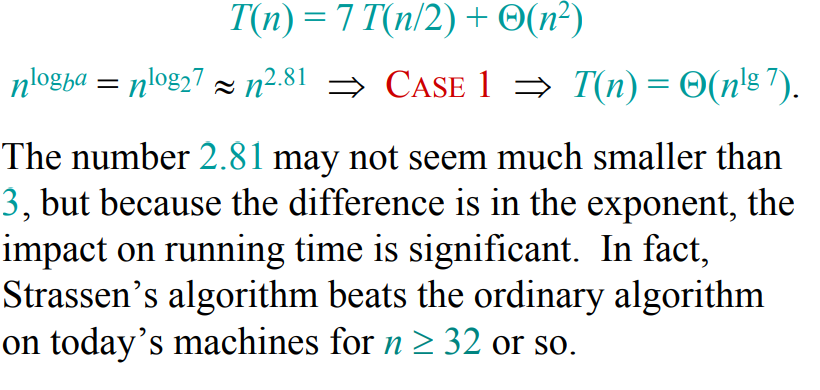
