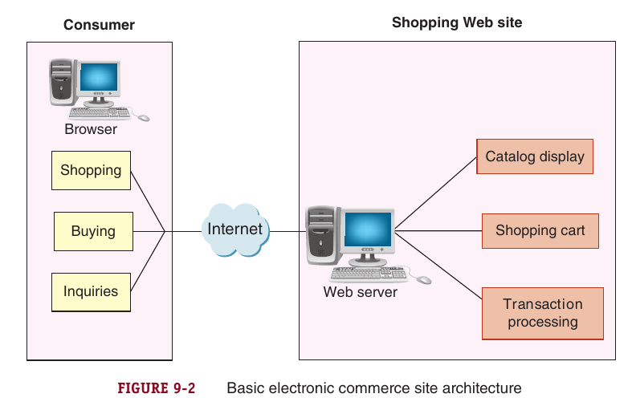
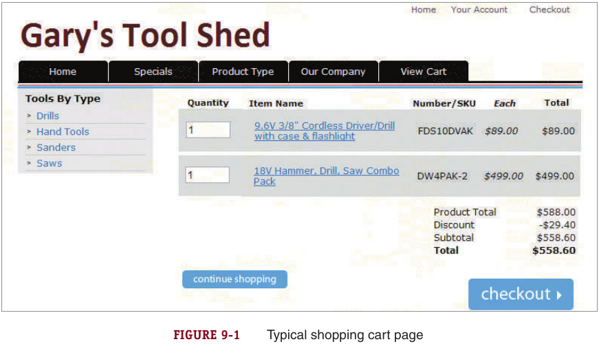

# Chapter 9: E-Commerce Software

### Introduction

ISPs have several identities based on the service they p+rovide. (ليهم كذا اسم حسب الخدمة للي بيقدموها)

- Internet Access $\implies$ **ISPs**
- Web hosting $\implies$ **CSPs**: (commerce service providers).
- Web Server management and software rental (databases, shopping carts, content management programs)  $\implies$ **MSPs** (managed service providers) \ **ASPs** (application service providers).

#### Web-hosting service

- The main categories of web-hosting services: **Shared**, **Dedicated**, and **co-location**.
- In both shared and dedicated, the service provider owns the web server hardware and software and provides the connection to the internet through its routers and other network then leases it - *grant/ make a contract* - to the client.
- In colocation hosting: 
  - The client installs its own software and maintains the server itself.
  - The provider offers a reliable power supply with backup provisions and a connection to the internet.
- Many providers offer scalable web service hosting services to adapt and meet changing requirements as clients grow.

**Types of Web-hosting Services**

- **Shared Hosting**: Single server hosts multiple clients (websites)

- **Dedicated Hosting**: A server is dedicated to host a single client i.e. the client does not share  the server with other clients of the service provider

  

      
Checkout the following figure

      
  
    

- **Colocation**: The client own its server hardware.

### Basic Functions of E-Commerce Software

 

 
    Basic E-Commerce Site Architecture

 
     

**Fundamental elements** an e-commerce software **must** provide:

- ***Catalog*** [Static catalog, Dynamic catalog]
- ***Shopping Cart***
- ***Transaction Processing.***

**Additional elements** for larger and more complex e-commerce sites.

- Middleware for **Interoperability.** i.e. integration with existing systems.
- Enterprise Application Integration [EAI].
- Web Services.
- Other Software:
  - ERP (Enterprise Resource Planning).
  - SCM (Supply Chain Management).
  - CRM (Customer Relationship Management).
  - KM (Knowledge Management)

#### Fundamental Elements [Details]

***Catalog***: an organized listing of goods or services offered for sale that can be grouped within logical departments to make locating an item simpler.

- Web store has the advantage to allow a single products belongs to multiple categories.
- Catalog service is located in the third tier of the three-tier website architecture.
- Most companies write their own software to link their databases to their websites.
- Besides search; most sites provide an **internal search engine** to which is a software to allow customers enter descriptive search terms so they can find items quickly.

Types of Catalogs

- <u>***Static***</u>: *a simple list, tagged with HTML codes, that can be displayed on a single Web page or a series of related Web pages.*
  - pros: Simple, short descriptions and a photo (single photo) of each item can be attached.
  - cons: The company must edit the HTML in order to manipulate the catalog.
- <u>***Dynamic***</u>: stores items information in a database, usually on a separate computer accessible to the server, hosts the client.
  - pros: multiple photos per item, detailed descriptions and include a search tool to enable customers to find items easily.

----------------

***Software Cart***: A bag that keeps track of the items customers have selected and allows customer to view, add, and remove items.

 

 
    Typical Shopping Cart Page 

 
     

- The standard method for processing sales online.
-  All of the details about the item, including its price, product number, and other identifying information.
-  The shopping cart calculates a total as well as sales tax and shipping costs along with any discounts
- Shopping Carts must store information about specific shoppers and their purchases.
  - Use ***<u>Cookies</u>***: *bits of information stored on a client computer*.
  - Use **<u>*Sessions*</u>**

Advanced higher-priced shopping cart software includes:

- ***<u>dynamic pricing management</u>***: adjust pricing in real time, order size, or any other variable.
- ***<u>promotion management</u>***: create product promotions in response to customer demand, seasonal preferences or any other variable.
- ***fulfillment services and product review management***.
- ***<u>product recommendation triggers</u>***
- ***<u>abandoned cart management</u>***: retain shopping carts when customer sessions terminate.
- ***<u>sales tax calculations and credit card processing</u>.***

-------------

***Transaction Processing***: occurs when the shopper proceeds to checkout.

- Performs volume discounts, sales tax and shipping costs.
- This function occurs in a secure state of communication.

### How Electronic Commerce Software Works With Other Software

- A basic element of any large company’s information system is its collection of databases.

#### Database

- ***A database*** is a collection of information stored on a computer in a highly structured way.
- The information structured in a database is determined by business rules.
- ***DBMS*** or ***Database Manager*** is a software that allow users to administrate and manage a database.
- **Examples:**
  - Low-end database such as Microsoft Access.
  - IBM DB2, MS SQL Server, Oracle.
  - MySQL; an open-source DBMS that a large number of companies uses.
- **Distributed Information Systems**: *large systems that store same information in many different physical locations.*
- **Distributed Database Systems**: *databases within distributed information systems.*

#### Middleware

- ***A middleware (in a e-business context)*** is a software that takes information about sales and inventory shipments and transmits it to accounting and inventory management software in a readable/ representative form.
- Most companies purchase middleware that is customized for their businesses by the software vendor or a consulting firm.
- The cost of a middleware depends on the customization needed to work in a given company.
  - i.e. the cost of a middleware does not depend on the software itself.

#### Enterprise Application Integration

> **Enterprise Application Integration**: 

- An **Application Program/Software or simply Application** is a program that performs a specific function.
  - **Business Rules** are actions or rules to be performed by an application program
- An **Application Server** is a computer that receive request messages from the Web Server perform a specific action using Application Software based on request.
- **Types of Application Server**
  - ***Page-based***: Combine Presentation and business logic in a page.
    - Hard to revise and update.
    - Examples: JSP, ASP, PHP, EJS, Adobe ColdFusion.
  - ***Component/Layer-based***: Each component is created and maintained separately for a specific functionality
    - EJBs, Microsoft COM and CORBA

#### Integration with ERP Systems

- Many Business-to-Business Websites must be able to connect to existing information systems such as ERP.
- ERP are not affordable for smaller online businesses; therefore, NetSuite offer subscriptions to ERP software for all sizes of businesses.
  - Offers Customization!
  - Then the business is provided by ERP software using a web browser.

> **Enterprise Resource Planning**: business systems that integrate all facets of a business including accounting, logistics, manufacturing, marketing, planning, project management and treasury functions (related to financial).
>
> - Two major vendors: SAP, ORACLE.
> - A sort of SaaS software.

#### Web Services

- *A **Web Service** is a set of software and technologies that allow computers to use the Web to interact with each directly without human operators.*
  - The interaction between applications is done across **APIs** and if the interaction is done across the Web; then they are called **Web APIs**
    - **APIs**: the way applications interact with each other

- Designed to automate narrow, specific functions in the background.
- Accomplish enterprise application integration.
- Less expensive and easily implemented alternatives to installing middleware software.
- Key element in WS:
  - Accesses units of business application logic without knowing the details of how each unit is implemented.
  - Allow programs written in different languages on different platforms to communicate with each other.

Web Services Specifications:

- ***Simple Object Access Protocol (SOAP)***: a message-passing protocol that defines how to send marked-up `XML` data between software programs across a network.
- ***Web Service Description Language (WSDL)***: describe the logic unit characteristics of each web service.
- ***Universal Description Discovery Integration (UDDI)***: registry identifies the location of web services associated with WSDL descriptions.

RESTful Design

-  In 2000, Roy Fielding outlined a principle called Representational State Transfer (REST), that describes the way the Web uses networking architecture to identify and locate Web pages and the elements (graphics, audio clips, and so on) that make up those Web pages.
- More than half of all Web services today are RESTful applications