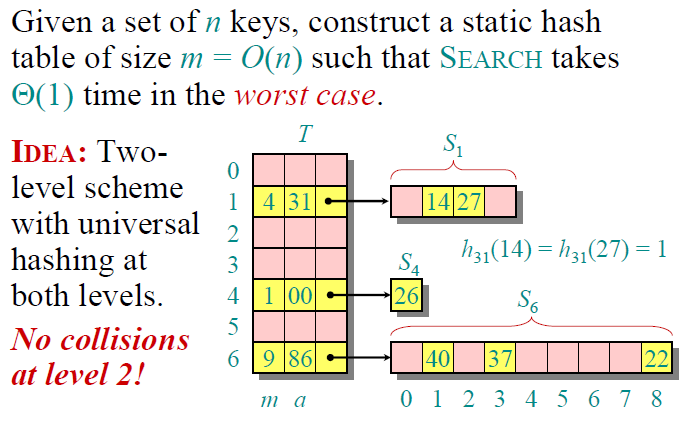

## Things more important than performance

- modularity
- correctness
- maintainability
- functionality
- robustness
- user-friendliness
- programmer time
- simplicity
- extensibility
- reliability

## Order

- Functions such as `5n^2` and `3n^4 + 100` are *pure* quadratic
- Functions such as `5n^2 + n + 100` are complete quadratic because they contain a linear term `n`

## Asymptotic Notations

- Big O
- Big Theta
- Big Omega

#### **O Notation** (upper bounds)

O-notation is an upper-bound notation used to identify the **worst case** of an algorithm. It makes **no** sense to say `f(n)` is at least `O(n^2)`.

###### Convention

A set in a formula represents an anonymous function in the set.

`f(n) = n3+ O(n^2)` means `f(n) = n3+ h(n)` for some `h(n) ∈ O(n2)`

`n^2 + O(n) = O(n^2)` means for any `f(n) ∈ O(n): n2 + f(n) = h(n)` for some `h(n) ∈ O(n^2)`.

#### Ω Notation (lower bounds)

Ω-notation is a lower-bound notation used to identify the **best case** of an algorithm. It **does** make sense to say `f(n)` is at least `O(n^2)`.

#### θ Notation (tight bounds)

Big Theta is either the exact performance value of the algorithm, or a useful **range** between **narrow** upper and lower bounds.

>  "The delivery will be there within your lifetime."

Everything that is `Theta(f(n))` is also `O(f(n))` , but not the other way around. For this reason **big**-**Theta** is more informative than **big**-**O** notation.


#### ο-notation and ω-notation (small o, small omega)

- O-notation and Ω-notation are like `≤` and `≥`.

- o-notation and ω-notation are like `<` and `>`.

## Solving Recurrences

- Substitution method
- Tree method
- Master theorem

#### Substitution Method

1. Build a solution
2. Expand
3. Repeat until a pattern shows up
4. Solve with T(1)

###### Example

Prove that `T(n) = 2T(n/2) + 4n` => `O(n log n)`

Solution: [(Plug-and-chug) Method](https://youtu.be/Ob8SM0fz6p0)

Do not replace 2^2 with 4, keep powers as n^k to help notice patterns.

#### Tree Method

1. Split the page into 4 sections (recursive calls, #nodes, tree, row sum)
2. Keep expanding until you can notice a pattern
3. Turn `#nodes` pattern into an `i` variable
4. Get sums of each row `Sigma`
5. Substitute `T(1)` into `i` into the sum equation

###### Example

Prove that `T(n) = 2T(n/2) + 4n` => `O(n log n)`

Solution: [Recurrence Tree](https://www.youtube.com/watch?v=sLNPd_nPGIc)

Do not replace 2^2 with 4, keep powers as n^k to help notice patterns.

#### Master Method

Works only on recurrences with the formula `T(n) = a T(n / b) + f(n)` where:

- `a >= 1`
- `b > 1`
- `f(n)` is of the format `Theta(n^k log^p n)`
- `n` is the size of the problem
- `n/b` is the size of each subproblem
- `p` is the cost of work outside the recursive calls
- `k` is power of `n` of a `f(n)`

Applies to a few cases only:


Steps:

1. Extract a, b, p, k
2. Determine case
3. Solve

## The Divide and Conquer Paradigm

1. Divide the problem into subproblems
2. Conquer each subproblem on its own
3. Merge all subproblem solutions

Algorithms based on it include:

- Merge Sort
- Binary Search
- Powering a number
- Fibonacci
- Recursive squaring
- Matrix multiplication
- VLSI layouts & H-tree embedding

## Merge Sort

- Comparison sorting

#### Steps

1. Divide the input array into single-element arrays
2. Recursively compare and merge arrays into bigger ones
3. Combine all solutions into a single final array

> T(n) = 2T(n/2) + Θ(n)

#### Finding its complexity

Applying Master theorem

```
a = 2
b = 2
f(n) = Theta(n^1) then p = 1
logb(a) = 1 = p then second case
finally T(n) = Theta(n logn)
```

## Binary Search

- [add details]

#### Steps

1. Check middle element and divide
2. Recursively search the subarray less than the middle element
3. Find value you're searching for and finish/merge

[Content missing here, lecture 3]

## Quick Sort

- Comparison sorting
- Practical when tuned
- Sorts in-place

#### Steps:

1. Partition input into 2 subarrays around a pivot such that elements in lower subarray <= x <= elements in upper subarray

2. Recursively sort the two subarrays using the invariant

   

3. Combining is trivial since this is in-place

#### Example

```
6 10 13 5 8 3 2 11
> set pivot as 6
> set i = 0
> set j = i + 1 = 1

> iterate j until element less than pivot found
> swap found element with element at i + 1

6 5 13 10 8 3 2 11
> set i = index of 5
> repeat

6 5 3 10 8 13 2 11
> set i = index of 3
> repeat

6 5 3 2 8 13 10 11
> set i = index of 2
> j reaches end

> swap pivot with element at i
[2 5 3] 6 [8 13 10 11]

> recursively sort each subarray
```

#### Analysis

>  Assume input elements are distinct

Worst case time

```
T(n) => worst-case time

if input is already sorted or reverse sorted then first partition will have 0 elements while the second will have n - 1 elements

T(n)= T(0) + T(n-1) + Theta(n), (n) for iteration over all elements while dividing, n - 1 while recursively sorting
	= Theta(1) + T(n-1) + Theta(n)
	= T(n-1) + Theta(n)
	= Theta(n^2) (arithmetic series like insertion sort)
```


Best case time (intuition only)

```
T(n) => best-case time

if pivot is in middle of the two partitions, so a n/2 : n/2 split

T(n)= 2T(n/2) + Theta(n)
	= Theta(nlgn)

If input is split as 1/10 : 9/10
T(n)= T(n/10) + T(9n/10) + O(n)

Which eventually
cn log 10/9 (n) + Theta(n) <= T(n) <= nlogn
```


#### Alternating lucky-unlucky

If we try to always depend on luck, we can play with it to perhaps "usually" be lucky

```
L(n)= 2U(n/2) + Theta(n)  			lucky
U(n)= L(n-1) + Theta(n) 			unlucky

> With math sub
L(n)= 2L(n/2 - 1) + Theta(n)

> Using Master's theorem
L(n)= Theta(nlgn) 					lucky!
```

#### Randomised QuickSort

- Running time indep of input ordering
- No assumptions about input distr
- No specific input elicits w-c
- W-C determined by random generator instead of input ordering

To "usually" be lucky we can:

- Pivot on a random element
- Randomize the input array

**Analysis**

> T(n) = r.v for running time assuming rand #'s indep

> This is too difficult for my poor brain

## Computational Models for Sorting Algorithms

- Comparison Model: Only use comparisons, cannot go beyond `nlgn`
- Decision-Tree Model: Representation using trees

## Decision Tree Model

- Each internal node is labeled i:j  `i, j ∈{1, 2,…, n}`
- The left subtree shows subsequent comparisons if `ai ≤ aj`
- The right subtree shows subsequent comparisons if `ai ≥ aj`

#### Decision Trees model comparison sorts

- **At least** one tree for each n (randomized quick sort has more than 1)
- View algorithm as splitting whenever it makes a comparison
- Tree lists comparisons along all possible instruction traces
- Running time (#comparisons) = length of path
- W-C runtime = height of tree

> Can be used to prove that comparison sort algorithms cannot go beyond `nlgn` by proving that the height of the tree has to be Omega(nlgn)

#### Lower bound on decision tree sorting

Any decision tree sorting n elements has height `Omega(nlgn)`

###### Proof

#leaves must be >= n!
 height h <= 2^h
 n! <= 2^h
 h >= lg n!


Meaning that the aforementioned comparison sorting algorithms with complexity `Theta(nlgn)` are **optimal** in the comparison sorting model.

## Count Sort (Sorting in linear time)

- Have to make stronger assumptions about data, such as "n is in range of x - y"
- Stable
- Fits for smaller, integer numbers only because of its space complexity
- If `k=O(n)` then counting sort takes `Theta(n)`
- If `k>O(n)` then count sort falls into the same category as comparison sorting algorithms, making it slower than randomized algorithms
- A hybrid approach combining Count Sort with Merge Sort/Randomized Quick Sort is better

## Stable sorting algorithms

The relative order of equal elements is preserved.

## Radix Sort

- Bad first idea: Sort on the most significant digit first with aux stable sort
- Good idea: Sort on the least significant digit first
- Digit-by-digit sort
- Integers only
- Uses another algorithm like count sort for intermediate stable sorting
- Unlike quicksort, radix sort displays little locality of reference, and thus a well-tuned quicksort fares better on modern processors, which feature steep memory hierarchies
- For 32 bit numbers
  - At most 3 passes when sorting ≥ 2000numbers.
  - Merge sort and quicksort do at least ⎡lg2000⎤= 11passes.

> I would rather not go further into the analysis of this algorithm

## Order Statistics

Given n elements in array, find kth smallest element (elt of rank k)

###### Naive O(n)

1. Sort A
2. Return A[k]

###### Randomized Divide and Conquer (Random-Select) (A-p-q-i)

Find `i`th smallest element in A[p-q]

```
RAND-SELECT(A, p, q, i) ith smallest of A[p..q]

if p= q then return A[p]
r ← RAND-PARTITION(A, p, q)
k ← r–p+1, k = rank(A[r])

if i=k then return A[r]
if i<k then return RAND-SELECT(A, p, r –1, i)
else return RAND-SELECT(A, r + 1, q, i –k)
```

## Symbol Table Problem

A table `S` holding `n` records where each record typically has a pointer to actual data, aside from satellite data.

Operations on this table include:

- Insert(S, x): add value to set
- Delete(S, x): delete value from set
- Search(S, x): returns x or nil in case x doesn't exist

>  Operations that change the set make the set "dynamic"

Insertion and deletion take the record, not a key. A bunch of implementations for this exist.

#### Direct Access Table

- Suppose keys are drawn from u={0, 1, ..., m-1}
- Assume all keys are distinct
- Setup array T[0, ..., m-1] to rep dynamic set S

```
T[k] = {
	x, 		if x exists in S, key[x] = k
	nil,	otherwise
}
```

###### Analysis

Operations take `O(1)` time, but suffers a few limitations.

- `m-1` can be a huge number
- Suppose keys are drawn from character strings, this will cause the table to be too big and waste a lot of space

These problems are solved with **hashing**.

## Hashing

Hash function `h` maps keys 'randomly' into **slots** of table `T`. This could potentially map multiple keys into the same slot, causing **collision**. Unlike cache, you can't just ignore collisions by throwing out old data,  because a hash table must accurately represent the data.

#### Common Hash Functions

- Division Method
- Multiplication Method

#### Resolving collisions by chaining

Idea is to link records in the same slot into a list.

###### Worst Case Analysis

Case: All keys hash to the same slot.

Result: Searching for a key will result in a `O(n)` search complexity.

###### Average Case Analysis

- Assume simple uniform hashing
- Each key `k` equally likely to be hashed to any slot in `T` **independent** of where other keys are hashed, causing the probability that any key would be hashed to a unique slot `1/m`

#### The Load Factor

The load factor of a hash table with `n` keys and `m` slots is `alpha = n/m = average number of keys per slot`

###### Expected unsuccessful search time

Searching for something that's not in the table, `nil`:

```
Theta(1 + alpha)

1 -> hash & access slot cost
alpha -> search list cost
```

###### Expected search time

On average, `Theta(1)` if `alpha = O(1)` or `n = O(m)`

> Hashing functions don't go Theta(1) always, but rather depend on the load factor

#### Choosing a hash function

The assumption of **simple uniform hashing** is **hard** to guarantee, but several common techniques work well as long as their deficiencies can be avoided.

- Should distribute the keys uniformly into the slots of the table
- Regularity in the key distribution should not affect this uniformity (such as inserting only even numbers)

#### Division Method

- Assume all keys are integers
- Define `h(k) = k mod m`
- Don't pick `m` with small divisor `d` (deficiency)
- Don't pic `m = 2^r` (extreme deficiency)
- Is **inferior** to other methods because division on most processors go through **more cycles** than other mathematical operations

###### Deficiency

If `d = 2` and all keys are even then the table will `h(k) = k mod 2` which wastes half of its slots, the odd number slots.

###### Extreme deficiency

If `m = 2^r` then the hashing function won't depend on all **bits** of `k`. A really common regularity in data is that all low bits are the same and the higher ones are different.

Example:

```
k = 1011000111011010, r = 6
h(k) = k mod 2^6 = 011010, only last 6 bits instead of whole number
```

###### Solution

Pick `m` to be a prime not too close to a power of `2` or `10` because those are the common two bases you see regularity in the world.

#### Multiplication Method

Generally better than others

- Assume computer has w-bit words
- `m = 2^r`
- `h(k) = (A.k mod 2^w) right shifted (w - r)` where `A` is an odd integer
- Don't pick A too close to `2^w-1` or `2^w`
- Multiplication modulo `2^w` is fast compared to division
- The right shift operation is fast

Example:

```
m = 8 = 2^3, w = 7
A = 1 0 1 1 0 0 1
k = 1 1 0 1 0 1 1

A.k = {1 0 0 1 0 1 0} {0 1 1} {0 0 1 1}
	  {   ignored	} {h(k) } {rsh -> }


```

#### Resolving collisions by open-addressing

- No storage for links
- Probe table systematically until empty slot is found
- `h - U x {0, ..., m-1} -> {0, ..., m-1}`, `U` is universal keys
- Probe sequence should be a permutation (in a random order)
- Table may fill up `n <= m`
- If it's full, you'll probe too many times and find no available slot
- Deletion is difficult

###### Probing Strategies

- Linear: scan down `mod m`, don't have to recompute the hash function, just go to the next slot
  - This method, though simple, suffers from primary clustering, where long runs of occupied slots build up, increasing the average search time.
- Double hashing: `h(k,i) = (h1(k) +i⋅h2(k)) mod m`
  - This method generally produces excellent results, but h2(k) must be relatively prime to m. One way is to make ma power of 2and design h2(k) to produce only odd numbers.

## Universal Hashing

For any hash function `h`, a set of keys exists that all hash to the same slot, which can cause the average access time of a hash table to skyrocket.

Choosing a random hashing function can counter this effect. Even if an **adversary** can see your code, they cannot find a bad set of keys, since they **don't know** exactly **which** hash function will be chosen. You might get **unlucky** in your random choice, but that choice will be **random** and **not depend** on input by the adversary.

#### Definition

Let `U` be a universe of keys, `H` a finite collection of hash functions. We say `H` is universal if for all `x, y ∈ U`, where `x ≠ y`, we have `|{h ∈ H : h(x) = h(y)}| = |H|/m`.

I.e. If `h` is chosen randomly from `H`, the probability of collision between x and y is `1/m`.

> The probability space is defined over the hash functions, not the keys.

#### Theorem

Let `h` be a hash function chosen (uniformly) at random from a universal set `H` of hash functions. Suppose `h` is used to hash `n` arbitrary keys into the `m` slots of a table `T`. Then, for a given key `x`, we have `E[#collisions with x] < n/m`, `n/m` being the load factor of the table, which is what we want.

#### Proof


#### Constructing a universal hash function

- Let `m` be prime
- Decompose any `k` key in our universe into `r + 1` digits
- Pick `a` at random, each `a@i` is chosen randomly from {0,...,m-1}
- Define hash function `h@a(k)`

> See lecture slides for actual value ranges and notations

How big is `H = {h@a}`? |H| = `m^(r + 1)`.

[missing content]

>  There's a theorem about this and is proven in the lecture, my brain is too weak for it at the moment xd

## Perfect Hashing

Use a hash table (level 2) in case of a collision on any slot instead of using a single hash table with a list for colliding keys. Following the universality of hashing functions, instead of having `1/m` we'd have `1/2` colliding keys (Markov's Inequality).


