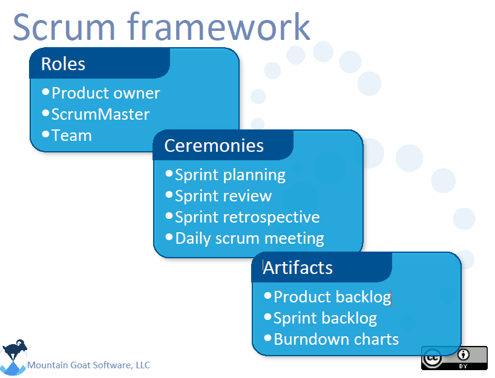
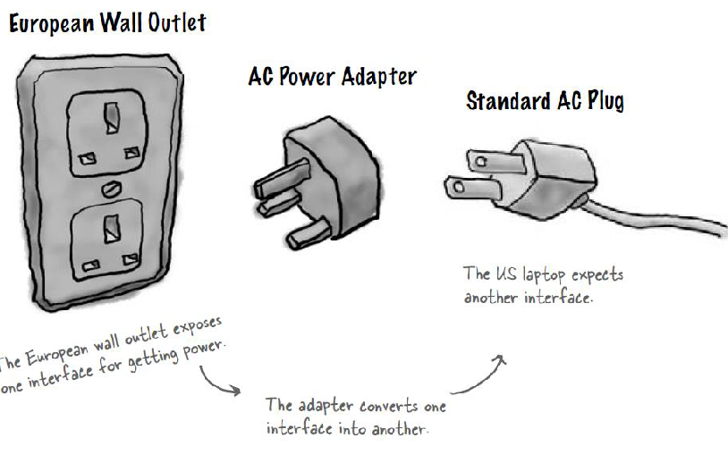
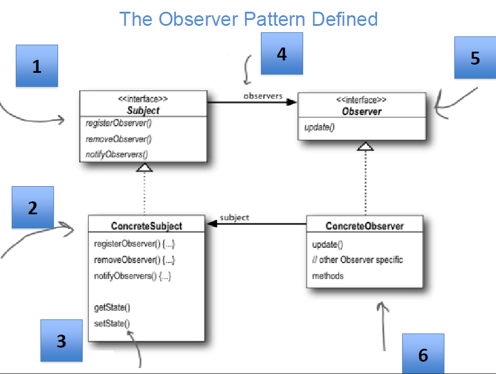
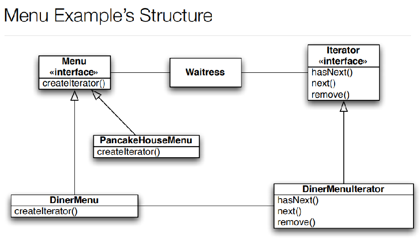
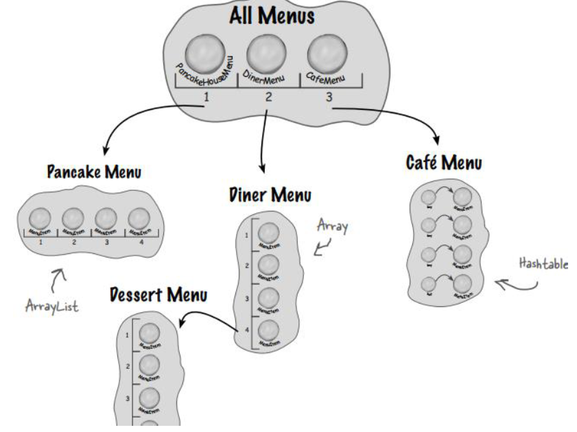
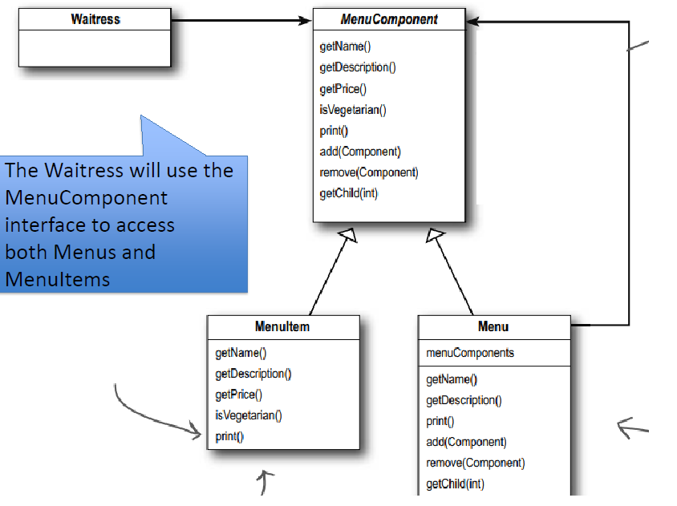

# Software Engineering Quick Summary

## Types of software

- Application
- Scientific
- System
- SPL (Software Product Lines)
- Legacy

## Four categories of popular software

- Web
- Mobile
- Cloud
- SPL

## Myths:

- A book of standards is not sufficient by itself, but rather by applying its rules.
- Adding more developers to an already late project will make it later.
- Outsourcing is not a silver bullet. A company that doesn't know how to manage its own products will inevitably fail.
- Ambiguous objectives are not enough for software.
- Early changes have lower impact on the product, and a lower cost.
- Later changes have higher impact, higher cost, and more risks.
- Programs are not done by the time of the first deliverable. They require maintenance.
- Quality assurances can be made before a program is complete, unlike popular belief.
- Deliverables include code, docs, plans, and models.
- Documentation doesn't slow down development.

## The definition of great software:

- Does what customers expect
- Is maintainable
- Is flexible

> The only constant in software is **change**

## The Eclipse IDE case study:

- Do we not need features?
- Are we not using it to the fullest?

> Poor changes have bad consequences

## Tips for making great software:

- Aim for extensibility and flexibility
- Make classes cohesive
- Encapsulate variables, implement unique
- Interface > Implementation
- Make classes about behaviour, not structure

## SOLID Principles
- Single responsibility
  - Each class should have one single responsibility
  - Fork & Spoon example
- Open closed
  - Entities should be open for **extension** and closed for **modification**
  - The mixer example
  - Interfaces and Delegation can be used
- Liskov substition
  - Instances should be replaceable with their subtypes
  - Chess board example
  - Inheritance and Delegation maybe used
- Interface segregation (interface isolation)
  - No client should depend on interface methods it doesn't need
  - The charger example
  - Fat interfaces should be broken down into smaller units
- Dependency inversion
  - Depend on abstractions instead of implementations
  - The power outlet and (aluminum and copper) cables example
  - Backend-Frontend example
  - Button-Lamp example

## Scrum

## Design Patterns: Strategy

Code for interfaces rather than implementations. Use abstract classes and interfaces combined with method delegation and polymorphism to achieve independence of object-specific attributes.

#### Duck Example

- Use `QuackBehaviour` as abstract interface
- Extend that in `Quack`, `Squeak`, `Mute`
- Create a Duck class that have `QuackBehaviour` interface type members instead of specific implementations
- Reference interface methods instead of instance methods to be completely independent of implementations

## Design Patterns: Adapter

**Adapt** an interface to another incompatible system by providing an intermediate interface that maps the adaptee to the structure you require.

>  Converts the interface of a class into another interface the clients expect.

## Design Patterns: Observer

The Observer Pattern defines a one to many dependency between objects so that when one object changes state, all of its dependents are notified and updated automatically.

> Aka pub-sub, and applies to a lot of domains, including caching and databases

#### Push vs Pull

- The subject (i.e. the Observable) sends the observer on notification a specific set of data that it will need. The observer doesn't need to query the subject for information.
- The subject merely notifies the observer that something happened, and the observer queries the subject based to get the information it needs.

## Design Patterns: Iterator

A design pattern that helps with the management of collections. It imposes restrictions on the shape of all similar collections available by enforcing the usage of shared abstract interfaces instead of implementations to make a client independent of how each collection works.

The Java JDK may be an example of this. All of its collection-style objects such as `ArrayList` and `Vector` have the same method names despite the potentially different underlying implementations.

- Provides a way to access the elements of an aggregate object sequentially without exposing its underlying representation.
- Allows traversal of the elements of an aggregate without exposing the underlying implementation.
- Places the task of traversal on the iterator object, not on the aggregate, which simplifies the aggregate interface and implementation, and places the responsibility where it should be.

#### The Diner and Pancake House Menu Merge

We'd like to merge two different lists together, both have the same structure, just different implementations. One uses a simple array and the other uses an ArrayList object, and they expose their bare methods, `[]` syntax for the array, and `.get` for the ArrayList implementation. This is bad for merging.

## Design Patterns: Composite

- Allows you to compose objects into tree structures to represent whole hierarchies.
- Lets clients treat individual objects and compositions of objects **uniformly**.
- Using a composite structure, we can apply **the same operations** over both composites and **individual** objects.

#### The Diner and Pancake House Nested Menus Example

We need to implement a more complex system that allows us to store different shop menu and to nest menus inside each other. The following structure is currently implemented:

This implementation is faulty, doesn't follow SOLID, and is inconsistent among different shops. We could use a composite `MenuComponent` **interface/abstract** that enforces how each `MenuItem` and `Menu` behave, and allows us to store them safely together in the same `MenuComponent` container.

#### Is the Composite Design Pattern SOLID?

A leaf implements methods that it may not use, which violates SOLID. Should we declare these operations in the Component, or should we declare and define them only in Composite? This faces a trade-off.

- Defining the child management interface at the **root** of the **class hierarchy** gives you transparency, because you can treat all components **uniformly**, but **costs you safety** because a clients could do meaningless operations on **illegal** methods.
- Defining child management in the **Composite class** gives you **safety**, because any **illegal** operation will be caught at **compile time** in a statically typed language like C++, but you **lose transparency** because each composites and leaves have different interfaces.
- Transparency over safety (GoF).

## Design Patterns: Singleton

Despite the complexity of modern applications, it's inevitable to want to create a single instance of some class throughout the whole life cycle of an application. The Singleton pattern ensures a class has only one instance, and provides a global point of access to it.

Singleton classes have their **constructor private** so clients can't instantiate instances from it, and expose a **static method** `getInstance` that returns that single instance. If this is the **first time** we call `getInstance` it **creates** an instance using the private constructor and stores it privately.

#### Is the Singleton Design Pattern SOLID?

There are multiple problems with the Singleton pattern:

- It breaks the Single Responsibility Principle, because the singleton class doesn't have a single responsibility, rather the responsibilities of itself as a class/object and the responsibility of maintaining and locking access to its constructor.
- It breaks the Open/Closed Principle, because the singleton class **itself** is in control over the creation of its instance, *while consumers will typically have a hard dependency on its concrete instance*. This **disallows** the implementation to be changed. This can be avoided using **subclassing**.

- It breaks the Dependency Inversion Principle (DIP), because  consumers will **always depend directly on the concrete class** to get the  instance, while the DIP prescribes the use of abstractions. This causes  the Singleton implementation to be dragged along and disallows adding  cross-cutting concerns by wrapping the implementation in a decorator or  distributing the client without that singleton implementation.

Although there are multiple problems, the Singleton pattern is still useful and this trade-off can be amended by keeping its instances in very specific and controlled environments, like controlling a shared database connection.