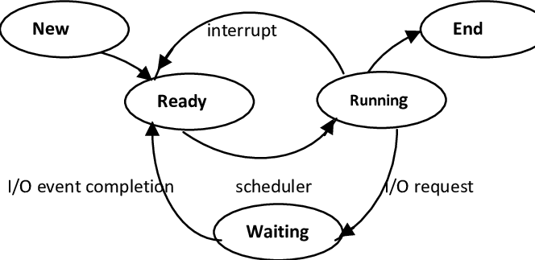
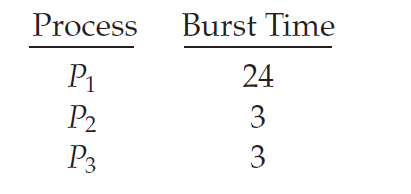
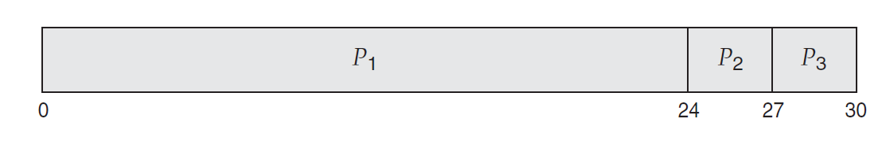
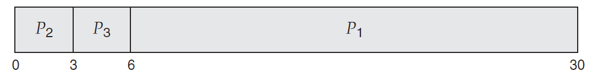
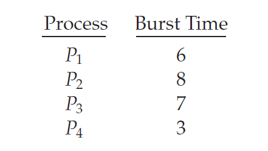
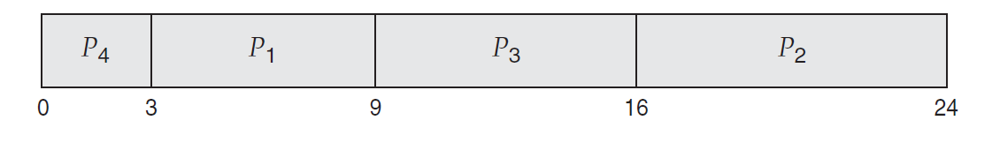

## *Chapter 6: CPU Scheduling*

### Basic Concepts

- Maximize CPU Utilization with Multiprogramming, which means the processes in memory must be scheduled to maintain a time slice for it.

- CPU or I/O bound processes, it's a cycle of CPU execution and I/O wait. So every CPU burst is followed by I/O burst.

- Short-Term Scheduling is CPU Scheduling. 

 #### 6.1.2 CPU Scheduler

  In short-term Scheduler or CPU scheduler, the CPU must select one of the processes in the ready queue to be executed. 

Note that the processes in memory are generally PCBs of the processes. Also, the ready queue can be in any kind based on the scheduler algorithm (FIFO, Priority, Tree, unordered linked list).

#### 6.1.3 Preemptive Scheduling

Preemption vs Non-Preemption

1. A process may switches from running state to waiting state. (an invocation of wait() or I/O request)

2. A process may switches from running state to ready state

   (time slice expired or interrupted by another process with high priority)

3. A process may switches from waiting state to ready state.

   (completion of I/O)

4. Process Termination

#### 6.1.4 Dispatcher

It carries out scheduler decisions. The dispatcher is invoked by the scheduler every process switch. Includes

- Context-Switch.
- Switching to user mode.
- Jumping to the proper location in the user program to restart that program.

Dispatcher Latency: is the time taken to stop one process and start another running process.

### Scheduling Criteria

Characteristics of Scheduling Algorithms

- CPU utilization: keep the CPU as busy as possible

- Throughput: The number of processes completed per time unit.

- Turnaround time: The Interval between 

  - the process' submission time.
  - the process' completion time.

  It's the sum of the periods spent waiting to ready, waiting in the ready queue, execution and doing I/O. It's better the average of turnaround time of all processes to be small.

- Waiting Time: amount of time of a process been waiting in the ready queue.

Note: The CPU-scheduling algorithm does not affect the amount of time during which a process executes or does I/O.

- Response Time: time taken to start responding to a user request until it the first response produced. not the output.

Note: The turnaround time is generally limited by the speed of the output device.

It is desirable to maximize CPU utilization and throughput and to minimize turnaround time, waiting time, and response time.

### Scheduling Algorithms

#### 6.3.1 First-Come, First-Served Scheduling (FCFS)

- Type: nonpreemptive.

  Reason: Once the CPU has been allocated to a process, that process keeps the CPU until it releases the CPU, either by terminating or by requesting I/O.

- The process that requests the CPU first is allocated the CPU first.
- When a process enters the ready queue, its PCB is linked onto the tail of the queue. When the CPU is free, it is allocated to the process at the head of the queue.

Cons: 

- The average waiting time is often quite long.
- Not suitable for time-sharing systems.

Consider the following example:

Suppose that the processes arrive at time 0 in the order P1, P2, P3, and are served in FCFS order

The waiting time is 0 milliseconds for process P1, 24 milliseconds for process P2, and 27 milliseconds for process P3. 

Thus, the average waiting time is (0 + 24 + 27)/3 = 17 milliseconds.

If the processes arrive in the order P2, P3, P1. the waiting time is 0 ms for P2, 3 ms and 6 ms for P1.

The average waiting time is now (6 + 0 + 3)/3 = 3 milliseconds. 

**Convoy Effect**: All I/O bound processes must wait for the CPU bound processes to get off the CPU which results in lower CPU utilization.

#### 6.3.2 Shortest-Job-First Scheduling (SJF)

This algorithm associates with each process the length of the process’s next CPU burst. Then the CPU is assigned to the process that has the smallest CPU burst.

Consider the following set of processes arrived at time 0, with the length of the CPU burst given in milliseconds:

The waiting time is 3 milliseconds for process P1, 16 milliseconds for process
P2, 9 milliseconds for process P3, and 0 milliseconds for process P4. Thus, the
average waiting time is (3 + 16 + 9 + 0)/4 = 7 milliseconds.

By comparison, if we were using the FCFS scheduling scheme, the average waiting time would be 10.25 milliseconds

### Multiple-Processor Scheduling

### Algorithm Evaluation

