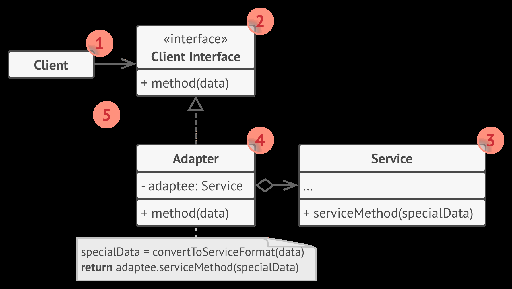
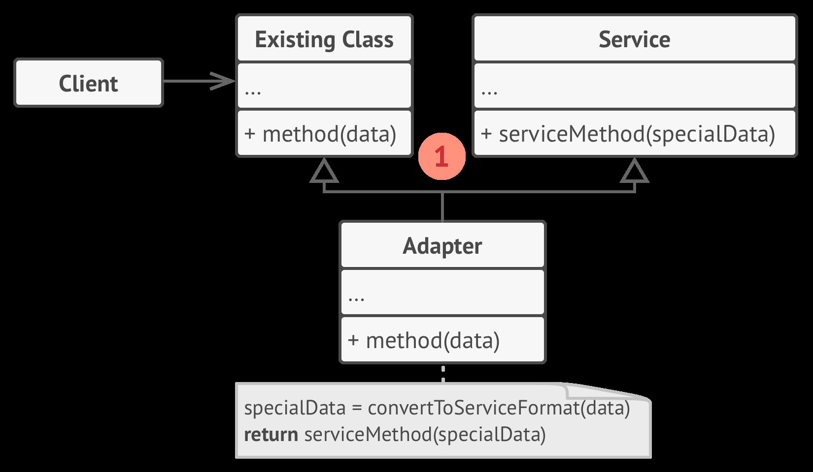

## Adapter Pattern

### Introduction

- Adapter is a ***structural*** design pattern that allows objects with incompatible interfaces to collaborate.
- Known as ***wrapper***.

### Structure

- One structure that uses the idea of coding to an interface.



- However, the other structure uses Inheritance.



the adapter inherits interfaces from both objects at the same time. Note that this approach can only be implemented in programming languages that support multiple inheritance, such as C++.

### Implementation

```java

```

### When to use

- When you want to use an existing class but its interface isn't compatible with yours.
- The Adapter pattern lets you create a middle-layer class that serves as a translator between your code and a legacy class, a 3rd-party class or any other class with a weird interface.