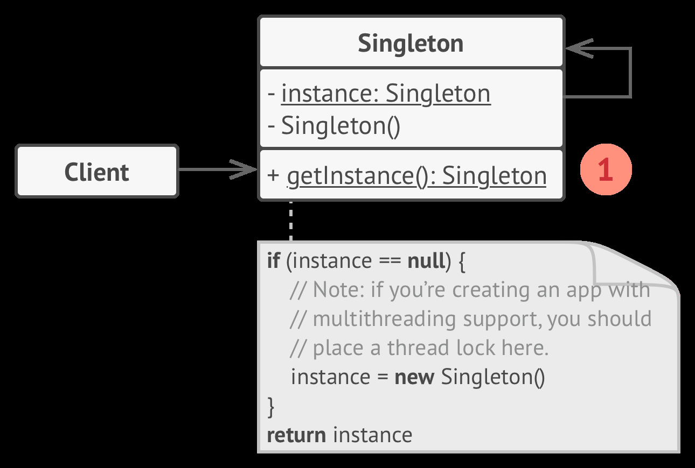

## Singleton Pattern 

### Introduction

- Singleton is a creational design pattern that lets you ensure that a class has only one instance, while providing a global access point to this instance

### Structure



### Implementation

```java
class Singleton
{
private static Singleton instance;

private Singleton(){}
    
public static Singleton getInstance(){
if(instance == null)
	instance = new Singleton();
return instance
}
 // Business Logic..   
}

// Instantiating 
public static void main(String args[]){
    Singleton singleton = Singleton.getInstance();
    // Implement the business logic of the singleton.
}
```

### When to use

- The class should have only single instance to gain global access point to that instance e.g. shared database.
- To strict the usage of global variables.

### When not to use

- It violates the single responsibility principle. the pattern solves two problems at the same time.
  - Ensuring only one instance created.
  - Implementing the business logic part.

- It requires special treatment in a multi-threaded environment, so that multiple threads won’t create a singleton object several times.
- It's difficult for unit testing. 

