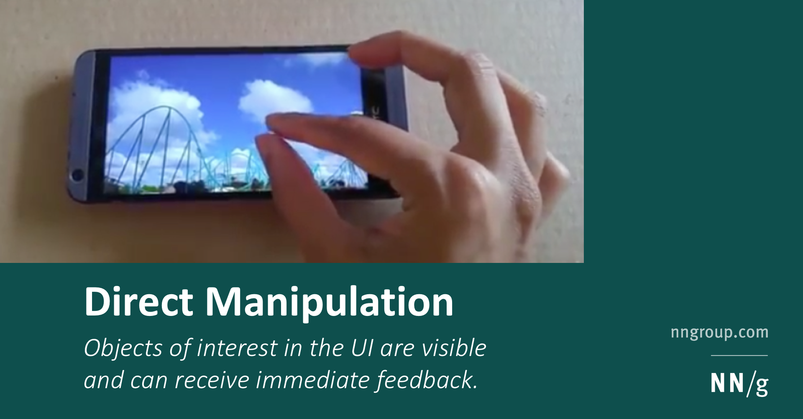
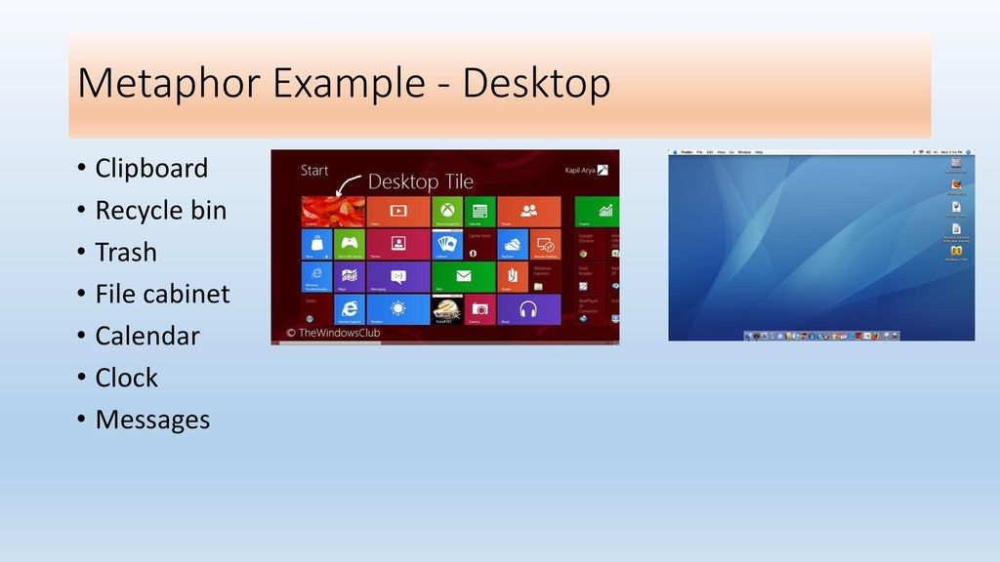
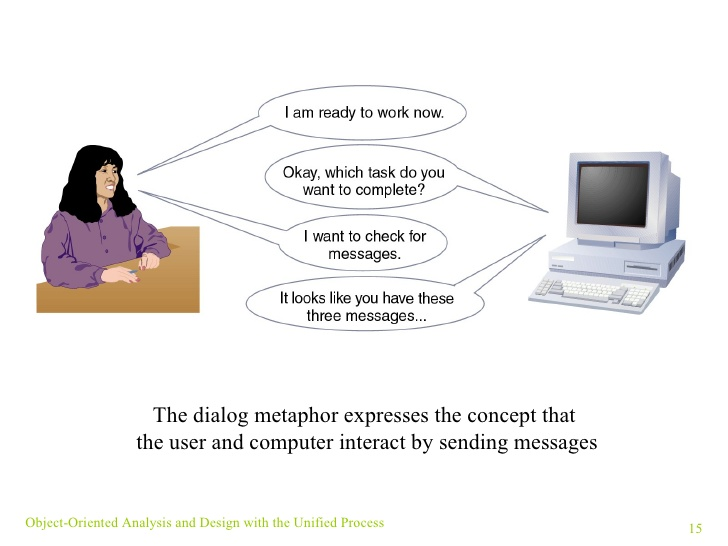

# Chapter Eight: Designing the User Interface

### Understanding the User Experience and the User Interface

**As a developer**, you must have a deep understanding of users, applications, devices, techniques, and principles to build effective user interfaces.

#### User Experience (UX)

##### *Definition*

- *All aspects of person's interaction with a software application such as actions, responses, perceptions and feelings.*

#### User Interface (UI)

##### Definition

- *The set of components that user sees and interacts with to invoke a function of an application such inputs and outputs.*

##### Notes

- UI depends on **interface purpose**, **user characteristics** and **characteristics of a specific interface**
  **device.**
- The user interface **is a major element in the total user experience.** Therefore, any considerations related to UI and UX must be integrated into all system development elements.

To make a good system design, You use ***user-centered design techniques***.

#### *User-centered Design*

##### *Definition* 

- Design techniques that embody the view that the user interface appears to be the entire system.

##### *Principles*

- Use Iterative Development

- Evaluate all designs to ensure **usability** 

  **Usability**: Degree of ease to use a system or how a easy a system to use.

- Focus on users and their work. Starts early throughout the project.

##### Notes

- **Easy-to-learn interfaces** are appropriate for systems that end users
  use **infrequently**.
- **Easy-to-use interfaces** are appropriate for internal users that need such a fast and flexible interface to deal with with shortcuts and hotkeys and so on.
- **Iterative developments** means doing some analysis, then some design, then some implementation, and then **repeating the processes.** This of type of development keeps the focus on user requirements to be evaluated after each iteration.

#### Human-Computer Interaction (HCI)

##### Definition

- A field of study concerned with the efficiency and effectiveness of user interfaces to computer systems, human-oriented input and output technology, and psychological aspects of user interfaces.

##### Related Fields

HCI is a broad field with many related fields of study such as

- *Interaction Design*
- *Efficiency*
- *Ergonomics*
- *Social Impacts*
- *Psychological influences*

#### *Metaphors for HCI*

##### Metaphors

###### Definition

- Analogies between features of the user interface and aspects of physical reality with which users are familiar

###### Types of Metaphors

- *Direct manipulation Metaphor*

  

- *Desktop Metaphor*:  The visual display is organized into distinct regions, with a large empty workspace in the middle and a collection of tool icons around the perimeter

  

- *Document Metaphor*: Data is visually represented as paper pages or forms

- *Dialog Metaphor*: Engaging a conversation between the user and the computer. Conversation would be voice/ text or tools. Voice Communication examples would be cortana or Ciri and Text communication would be Troubleshooting tools in the operating system for example

