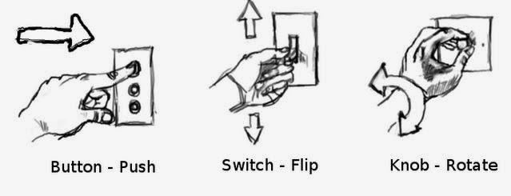
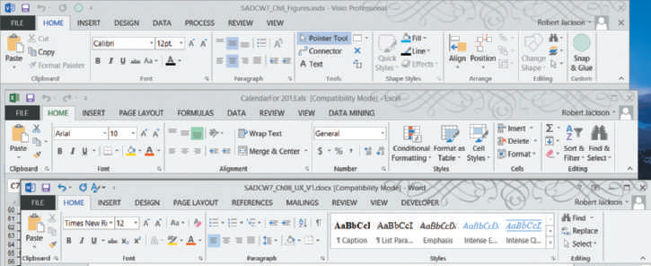
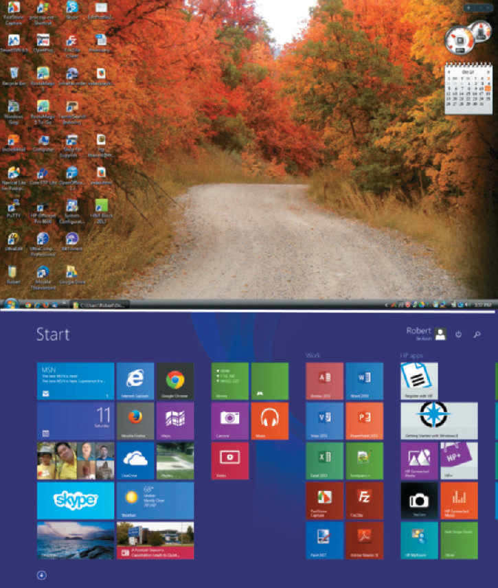
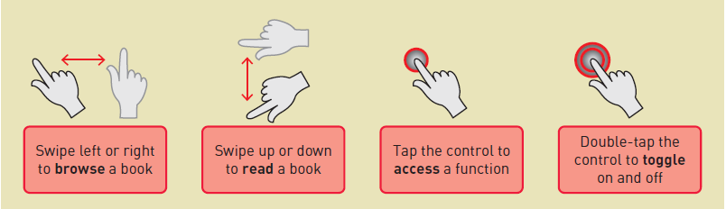

# Chapter Eight: Designing the User Interface

### Understanding the User Experience and the User Interface

**As a developer**, you must have a deep understanding of users, applications, devices, techniques, and principles to build effective user interfaces.

#### User Experience (UX)

##### *Definition*

- *All aspects of person's interaction with a software application such as actions, responses, perceptions and feelings.*

#### User Interface (UI)

##### Definition

- *The set of components that user sees and interacts with to invoke a function of an application such inputs and outputs.*

##### Notes

- UI depends on **interface purpose**, **user characteristics** and **characteristics of a specific interface**
  **device.**
- The user interface **is a major element in the total user experience.** Therefore, any considerations related to UI and UX must be integrated into all system development elements.

To make a good system design, You use ***user-centered design techniques***.

#### *User-centered Design*

##### *Definition* 

- Design techniques that embody the view that the user interface appears to be the entire system.

##### *Principles*

- Use Iterative Development

- Evaluate all designs to ensure **usability** 

  **Usability**: Degree of ease to use a system or how a easy a system to use.

- Focus on users and their work. Starts early throughout the project.

##### Notes

- **Easy-to-learn interfaces** are appropriate for systems that end users
  use **infrequently**.
- **Easy-to-use interfaces** are appropriate for internal users that need such a fast and flexible interface to deal with with shortcuts and hotkeys and so on.
- **Iterative developments** means doing some analysis, then some design, then some implementation, and then **repeating the processes.** This of type of development keeps the focus on user requirements to be evaluated after each iteration.

#### Human-Computer Interaction (HCI)

##### Definition

- A field of study concerned with the efficiency and effectiveness of user interfaces to computer systems, human-oriented input and output technology, and psychological aspects of user interfaces.

##### Related Fields

HCI is a broad field with many related fields of study such as

- *Interaction Design*
- *Efficiency*
- *Ergonomics*
- *Social Impacts*
- *Psychological influences*

#### *Metaphors for HCI*

##### Metaphors

###### Definition

- Analogies between features of the user interface and aspects of physical reality with which users are familiar

###### Types of Metaphors

- *Direct manipulation Metaphor*

  

- *Desktop Metaphor*:  The visual display is organized into distinct regions, with a large empty workspace in the middle and a collection of tool icons around the perimeter

  

- *Document Metaphor*: Data is visually represented as paper pages or forms

- *Dialog Metaphor*: Engaging a conversation between the user and the computer. Conversation would be voice/ text or tools. Voice Communication examples would be cortana or Ciri and Text communication would be Troubleshooting tools in the operating system for example

### Fundamental Principles of User-Interface Design

#### Human-Interface Objects (HIOs)

##### Definition

- Icons and other objects on a screen that can be manipulated by the user and cause action to occur.

##### Examples

- Desktop Icons

- The ribbons of icons at Microsoft Office suite

##### Principles

- ***Affordance***: The appearance of a specific control suggests its function—that is, the purpose
  for which the control is used. 

  Cut (scissors symbol) and search is a magnifier tool etc..!

  

  

- ***Tool Tip***: Brief instructions that pop up when the mouse hovers over a control

- ***Visibility***: When a control is visible so that users know it is available

  

- ***Feedback***: Some visual or audio response by the system in response to a user action

  

- ***Radio Buttons and Check Boxes***

  A group of radio buttons is a control that allows one item to be selected out of the group. A group of check boxes is a control that allows none or many items to be selected. As a radio button is selected, not only does it change its color, but the image also immediately changes.

##### Notes

- Visibility and affordance are relatively easy to achieve when the design target
  is a commonly used platform, such as an iPad
- Feedback provides the user with a sense of confirmation and the feeling that
  a system is responsive and functioning correctly.

#### Consistency

The effectiveness of the user experience is highly dependent on consistency.

Users not only expect consistency across the various screens of an application, but now also anticipate consistency across applications.

##### Types of Consistency

- Consistency Within and **Across Platforms**

  - Within a one platform is Achievable.
  - Within a Across platform is hardly achievable and challenging.
  - Therefore **Web-based applications bring consistency.**

- Consistency Within **a Suite of Applications**

  - Examples of Suite Applications: Adobe, Microsoft Office

  - Microsoft Office has achieved consistency across their applications.

    

- Consistency Within **an Application**

  - Occur when many developers use different font types, sizes and colors that lead to inconsistency and unprofessional look of the UI.

- Consistency **Versus** Continuity

  - **Continuity** maintaining a certain level of consistency over time, across multiple releases

  - This concept refers to changes occurring in new releases of an application.
    Almost every application will have upgrade after upgrade with new versions

    

#### Discoverability

Trying to provide an HIO control for every feature would make the user interface too cluttered and complex.  It is important that developers consider **the discoverability** aspect of user interface
design.

##### Definition

- A feature of the user interface that provides clues to help the users uncover hidden features

##### Active Discovery
- A user-interface feature to lead users to discover hidden features

###### Examples 

- One approach is to have a pop-up window appear at application initiation that provides hints and additional features.

- Another approach is to have a small text box appear as the user hovers over different locations of the
  screen. 

  This technique is best implemented with a slight delay so that the user is not continually being distracted by the opening and closing of myriad text boxes.

##### Visual Diagrams

#### Closure

##### Provide Closure on Dialogues

- Based on the **dialogue metaphor** and **HIOs principles such as visibility and feedback.**
- When a use case requires several steps, it is important that the user know that all the steps are completed.
- One technique to implement this process is to have a Continue button and a Finish button that indicate the end of the process. 
- Sometimes a progress bar is also included and a final message to indicate that the dialogue has successfully finished.
- Refreshing the final screen to return to a beginning point of the next dialogue also indicates closure.

##### Protect Users’ Work

- It is common with current applications to always ask the user if she wants to save her
  work before closing the application
- Another common feature is to inform the user when she tries to save a newer version of a file on top of an older one.

##### Make Actions Reversible (Undo)

- Users need to feel that they can explore options and take actions that can be canceled or reversed without difficulty.
- Both the application and the user interface must support this reverse function.

#### Readability and Navigation

- The Age of the target audience. [Kids, Adults]
-  The devices that will be used. [Mobile Devices and Desktops]
- Navigation Should Be Clear.
  - **Deep Hierarchical vertical**: simple menu with multi-level submenus.
  - **Shallow Horizontal**: many menu items and fewer submenus.
- Always Allow a Way Out
  - **Breadcrumbs (navigation)** is the technique of displaying the sequence of pages traversed to the current page. 
  - For example, RMOHome> Women’s clothes> WinterCoats indicates that the user has traversed three levels down to the winter coats page.

#### Usability and Efficiency

- Provide Shortcut Keys to Support Experienced Users
- Design Error Messages That Provide Solution Options
- Design for Simplicity
  - Fewer mouse clicks is always productive.
  - Fewer levels to navigate through increase speed of access

### Transitioning from Analysis to User-Interface Design

##### Use Cases and the Menu Hierarchy

Use case diagrams have direct impact on the representation of the menu shown in the program.

- Organize uses cases to be categorized (grouped) by actor or subsystem.
- Levels of the menu can be co

##### Analysis Models and Input Forms

- Using a system sequence diagram is a good starting point to identify the various screens and forms that may be needed for the user interface for a particular use case

##### Dialogues and Storyboards

- A System Designer must document system dialogues, they states how the user and system interact like a conversation.

- the designer can go right from building a dialogue to sketching a series of screens that make the design more understandable known as **Storyboarding**

  **Storyboarding** sequence of sketches of the display screen during a dialogue

##### Note 

- Storyboards can be primitive and simple, they are sufficiently detailed to show all the information presented to and entered by the user. 

- The storyboard can be reviewed by users and designers to identify missing or extraneous information.

### User-Interface Design

#### Decisions 

- Application Type
- Type of Device
- Operating System

### Designing Reports, Statements, and Turnaround Documents

##### Intro

##### Report Types

- **Detailed reports**: reports that contain specific information on business transactions
- **Summary reports**: reports that summarize detail or recap periodic activity
- **Exception reports**: reports that provide details or summary information about transactions or operating results that fall outside a predefined normal range of values
- **Executive reports**: reports used by high-level managers to assess overall organizational health and performance

