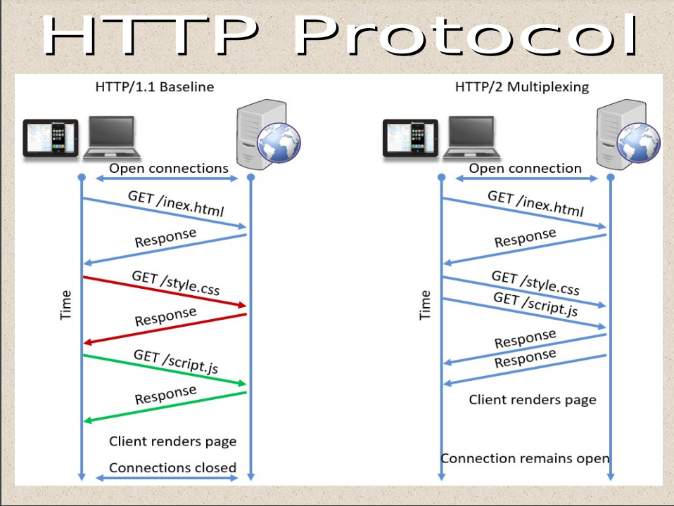

Introduction

#### Important Factors in IS Implementation

- System Architecture
  - Distributed
  - Various Servers and Various Clients
- Application Type
  - Business Logic 
  - UI (Front end layer)
  - Data Persistence and Modelling (Back end layer)
- Software Development Emphasis
  - Persistence
  - Accuracy
  - User Friendly GUI

#### Components of IS Architecture

- UI 
  - Dumb Terminal (CLI)
  - X - Terminal (Early GUI such as UNIX systems)
  - PCs
  - Mobile Phones/ Tablets
- Data Management
- Data Processing (Computation) 

#### Definitions 

**The Web**: is acronym for World Wide Web, It's a way of sharing information through the internet via Internet protocols such as ***HTTP as  data transfer protocol*** and ***HTML as a markup language for publishing and formatting web pages.***  

**The Internet:** an enormous global network of  billions interconnected computers and servers using a valid IP address.

#### Why Distributed (Decentralized) Systems

- Most businesses are already distributed.
- Makes services closer and available to customers who need these services.
- Consolidate the power of PCs  across the enterprise.
- User-friendly because they use the PC as the user interface processor.
- Total Cost of owning a distributed system is at least as expensive, because personal computers and network servers are less expensive than mainframe computers

#### Why Not Distributed (Decentralized) Systems

- Lots of network traffic.
- Security and Integrity more easily to compromise.

#### HTTP Protocol



#### Notes

- Identifying server machine is done by DNS 

  

- Identifying sever application is done by port number


- Identifying Clients is done by identifying IP addresses of the clients


#### Why Java

- Platform Independent

## Architecture 

#### System Architecture I

There are two traditional Architectures: 

##### Mainframe Architecture (1960) 

|     **Components**     |                **Characteristics**                |
| :--------------------: | :-----------------------------------------------: |
|    Server Hardware     |            Mainframe or mini computer             |
|    Client Hardware     |               Dumb Terminals (CLIs)               |
|     User Interface     |            Keyboard input, text output            |
|    Data Management     |                    Flat Files                     |
| Computation Management | COBOL programs (non-portable) executed on server. |
|          Cost          |                  Medium or high                   |
|      Reliability       |                       High                        |
|        Security        |                       High                        |
|      Scalability       |                       High                        |
|      Flexibility       |                        Low                        |


##### File – Server Architecture (1980)

|     **Components**     |                     **Characteristics**                      |
| :--------------------: | :----------------------------------------------------------: |
|    Server Hardware     |                             PCs                              |
|    Client Hardware     |                             PCs                              |
|     User Interface     |                 Keyboard input, text output                  |
|    Data Management     |                          Flat Files                          |
| Computation Management | Programs written in various languages (BASIC or dBase) executed on client |
|          Cost          |                             Low                              |
|      Reliability       |                             Low                              |
|        Security        |                             Low                              |
|      Scalability       |                             Low                              |
|      Flexibility       |                             Low                              |

##### Client-Server Architecture

|     **Components**     |                     **Characteristics**                      |
| :--------------------: | :----------------------------------------------------------: |
|    Server Hardware     |                PC, minicomputer, or mainframe                |
|    Client Hardware     |                              PC                              |
|     User Interface     |                             GUI                              |
|    Data Management     |                     Relational database                      |
| Computation Management | Programs written in various languages executed on server or client |
|          Cost          |                        Low to medium                         |
|      Reliability       |                             High                             |
|        Security        |                             High                             |
|      Scalability       |                             High                             |
|      Flexibility       |                             High                             |

##### Three-Tier Architecture

- Client can access to the Middleware server through a thin driver.

##### Web Server-based Architecture

- This is a particular form of Client-Server Architecture.
  - Web server – act as Server
  - Web browser – act as Client.

##### Network (Distributed) Architecture

- Distributed architecture includes multiple servers. 
- Every host potentially acts as both client and server. (Point to point architecture)

|     **Components**     |                     **Characteristics**                      |
| :--------------------: | :----------------------------------------------------------: |
|    Server Hardware     |                PC, minicomputer, or mainframe                |
|    Client Hardware     |                              PC                              |
|     User Interface     |                             GUI                              |
|    Data Management     |                     Relational database                      |
| Computation Management | Programs written in various languages executed on server or client |
|          Cost          |                            Medium                            |
|      Reliability       |                             High                             |
|        Security        |                             High                             |
|      Scalability       |                             High                             |
|      Flexibility       |                             High                             |

#### System Architecture II

##### Distributed VS. Centralized Systems

**Distributed** (Decentralized): The system in which its components (Data, Process, Interface) are distributed to multiple locations in a computer network.

Hence, Processing workload is distributed across the network.

###### Why Distributed Systems

- Most businesses uses distributed systems.
- Distributed computing moves information and services closer to the customers and users who need them.
- Distributed computing consolidates the power of personal computers across the enterprise.
- More-user friendly because PC is utilized as the end-user interface. 
- PCs and network servers are cheaper than centralized computers.

###### Computing Layers

- Presentation Layer: User Interface
- Presentation Layer Logic: such as Input editing
- Application Logic Layer: Business rules, policies and procedures.
- Data Manipulation Layer: database CRUD (store and retrieve)
- Data Layer: the actual business layer.

**Centralized**: A central multi-user computer hosts all the components of an information system.

- Users interacts with system via terminals.

- Slides 30/53

## Web Application


Web applications are helper applications that resides at web server and build dynamic web pages. 

- Type of a client/server application.
- Client access an application at a server computer through via the internet.
- Web browser (client) provides the application's user interface.
- Web application (Java) runs on the server computer under the control of web server software (Apache)
  - Example: For Java web applications, the Apache server is the most widely used web server.
- Most web applications uses database management systems in the server computer.
  - Example: Servlet and JSP applications uses MySQL & Oracle are the most popular database management system.


- Communication in web application is done  between client and server via HTTP protocol.

### Static Pages


A static web page is an HTML document that's stored in a file. The document doesn't change in response to user input. 

A Static HTML page has an extension of .htm or.html.


### Dynamic Pages


It is an HTML document generated by a web application. This HTML document is subtle to change according to parameters that are sent to the web application by the web browser.


### JSP

##### Introduction

- Technology allows to create dynamic web applications.
- JSP adds Java code inside HTML using JSP tags.
- JSP allows the developer to separate Presentation and Business Logic.
- JSP pages are converted to Servlet via the Web Container (Tomcat). 
  - To service requests.
  - Also called JSP Life Cycle
- JSP is built on Java technology, so it is platform independent.

##### Life Cycle

The translation of a JSP page to a Servlet is called Lifecycle of JSP.

JSP Lifecycle is exactly same as the Servlet Lifecycle, with one additional first step, which is, translation of JSP code to Servlet code

1. Translation of JSP to Servlet code.
2. Compilation of Servlet to bytecode.
3. Loading Servlet class.
4. Creating servlet instance.
5. Initialization by calling `jspInit()` method
6. Request Processing by calling `_jspService()` method
7. Destroying by calling `jspDestroy()` method
8. 


##### JSP Scripting Elements (Tags)

JSP Scripting element are written inside `<% %>` tags. These code inside `<% %>` tags are processed by the JSP engine during translation of the JSP page. 

Any other text in the JSP page is considered as HTML code or plain text.

Types of Scripting Elements 


1. Expressions

   - Syntax: <%=  %>

   - Evaluated at runtime, when the page is requested.
2. Scriptlets

   - Syntax: <% %>
   - Java code to execute a print statement for example

3. Declarations

- Syntax: <%!  %>
- Declare variables or methods to be used.

When to use Declaration tag and not scriptlet tag

If you want to include any method in your JSP file, then you must use the declaration tag, because during translation phase of JSP, methods and variables inside the declaration tag, becomes instance methods and instance variables and are also assigned default values.

While, anything we add in scriptlet tag, goes inside the `_jspservice()` method, therefore we cannot add any function inside the scriptlet tag, as on compilation it will try to create a function `getCount()` inside the service method, and in Java, method inside a method is not allowed.

4. Directives

**Directive Tag** gives special instruction to Web Container at the time of page translation. Directive tags are of three types: **page**, **include** and **taglib**.

##### Implicit Objects

- JSP Container makes certain JAVA Objects available on JSP. 

- These objects are called Implicit objects. 

- Implicit objects need not to be declared, defined or instantiated like other JAVA Objects.

- NOT accessible in JSP declarations .

- For example you can retrieve HTML form parameter data by using **request** variable, which represent the **HttpServletRequest** object.

  

- Implicit Objects


Notes about Session object:

- A session object is created when a browser makes the first request to a site.
- A session ends when a specified amount of time elapses without another request or when the user exits the browser.


### Servlet

##### Introduction

- **Servlet** Technology is used to create web applications.
- **Servlet** technology uses Java language to create web applications. Servlet apps are Secured, Scalable, Robust and Platform independent
- Servlets may return data of any type but they often return HTML.

##### Imports

- All servlets classes must import the following packages:

  ```java
  import java.io.*;
  import javax.servlet.*;
  import javax.servlet.http.*;
  
  // All servlets classes must extend the HttpServlet class
  ```

##### Life Cycle

1. When a servlet is FIRST requested, it is loaded into the servlet engine. The init() method of the servlet is invoked so that the servlet may initialize itself
2. Once initialization is complete, the request is then forwarded to the appropriate method (ie. doGet or doPost)
3. The servlet is then held in memory. Subsequent requests are simply forwarded to the servlet object.
4. When the engine wishes to remove the servlet, its destroy() method is invoked.


##### Transfer to JSP page

- Using RequestDispatcher

```java
RequestDispatcher requestDispatcher = request.getRequestDispatcher("index.jsp");
requestDispatcher.forward(request, response);
```

- Using Redirection

```java
response.sendRedirect("index.jsp");
```

### Sessions

Sessions are used to hold the state (client actions) across the entire session with the client.

- HttpSession object is maintained at the server.
- Created when the browser makes the first request 
- Destroyed when it expires or the browser is closed.
- Each Client would have his own HttpSession object and Session ID/Name.


- To close a session

```java
session.invalidate();
```

### Cookies

- Resides at the client.
- Web server sends a cookies to a browser to save it and the browser returns unchanged when visiting the same Web site later 
- Age per session: till the browser is closed.
- Max Age: 3 years

### Sessions vs Cookies


## Connecting to Database

- JDBC

- Setup a database connection

```java
Connection connection = DriverManager.getConnection(dbURL, username, password);
```

- Load MySQL driver

```java
Class.forName("com.mysql.jdbc.Driver");
```

- Creating Statement

```java
Statement statement = connection.createStatement();
```

- Execute a statement (Query): Return records

```java
ResultSet resultSet = statement.executeQuery(query);
```

- First Record of a resultSet

```java
resultSet.next();
```

- Looping through resultSet

```java
while(resultSet.next()){
	// some code;
}
```

- Retrieve records from result sets

```java
// getXXX(int columnIndex);
// getXXX(String columnName);
// XXX: return the column as datatype of XXX

String ID = resultSet.getString("ID");
```

Execute DDL Queries

```java
// query: insert, delete and update;
// executeUpdate() is used
statement.executeUpdate(query);
```

Various Topics

#### Difference Between GET and POST requests

